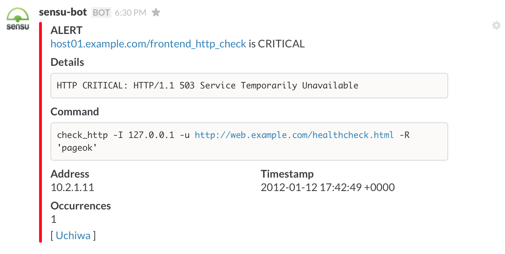

## Sensu Slack Handler

This is a fork of [https://github.com/sensu/sensu-community-plugins/blob/master/handlers/notification/slack.rb](https://github.com/sensu/sensu-community-plugins/blob/master/handlers/notification/slack.rb)

This version is a bit more verbose.

## Screenshot



## Configuration

Take a look at [slack.json](slack.json) for example configuration options.

### Custom Values

Sensu supports custom attributes for clients and checks, which can be
referenced with this handler.

See [https://sensuapp.org/docs/latest/clients#custom-definition-attributes](https://sensuapp.org/docs/latest/clients#custom-definition-attributes) for context.

Example:

```json
{
  "checks": {
    "Uptime": {
      "command": "/opt/sensu-plugins/check_uptime.sh -w 5",
      "interval": 120,
      "subscribers": [
        "base"
      ],
      "standalone": true,
      "handlers": [
        "slack"
      ],
      "team": "FooBar"
    }
  }
}
```

Here, "team" is a custom attribute for this particular check. To reference
that key with this plugin, do something like this:

```json
{
  "slack": {
    "custom_values": [
      {
        "key": "team",
        "title": "Team",
        "short": true
      }
    ]
  }
}
```

This will add a Slack field for the "team" and title it "Team". We're also
indicating that it's a short value here.

For nested attributes, such as:

```json
{
  "client": {
    "name": "vagrant-7192437364.vagrant.vm",
    "address": "10.0.2.15",
    "subscriptions": [
      "vagrant",
      "base"
    ],
    "bind": "127.0.0.1",
    "port": "3030",
    "safe_mode": false,
    "keepalive": {
    },
    "custom_stuff": {
      "team": "something-ops",
      "tel": "555-555-5555"
    }
  }
}
```

You can do something like this:

```json
{
  "slack": {
    "custom_values": [
      {
        "key": "custom_stuff.team",
        "title": "Team",
        "short": true
      },
      {
        "key": "custom_stuff.tel",
        "title": "Phone Number",
        "short": true
      }
    ]
  }
}
```

Separate each hash with a period.

## Testing

You can test the plugin by piping event data to it.

Refer to [https://sensuapp.org/docs/0.12/events](https://sensuapp.org/docs/0.12/events)
for sample data.  Then do something like:

```shell
cat sample.json | slack.rb
```
